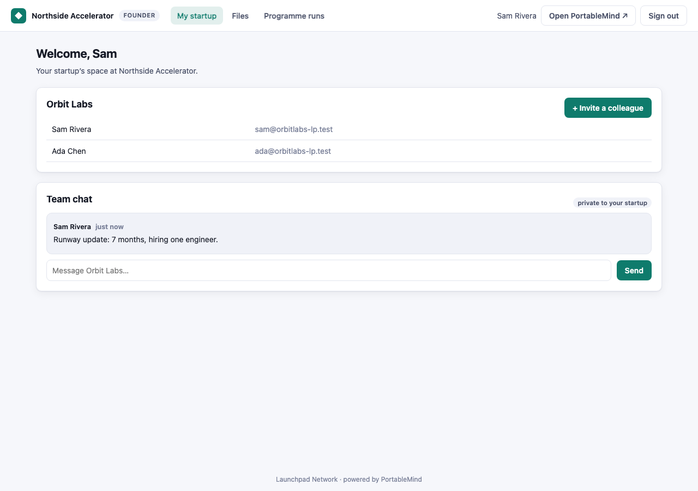
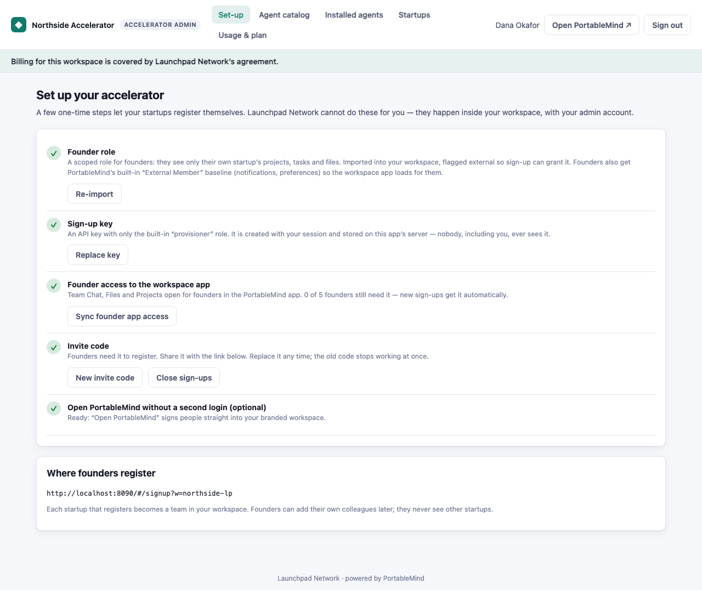
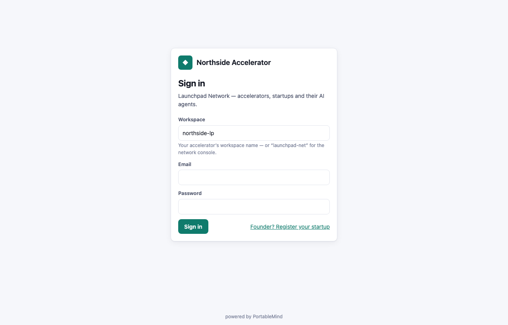
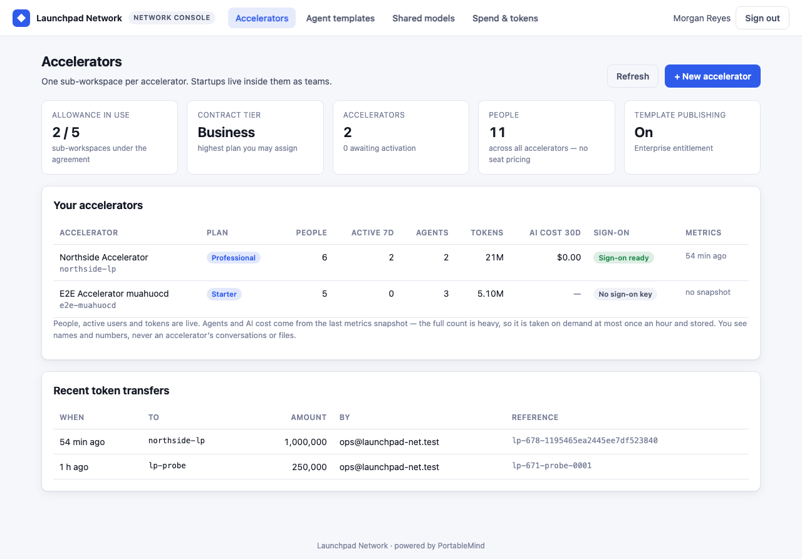
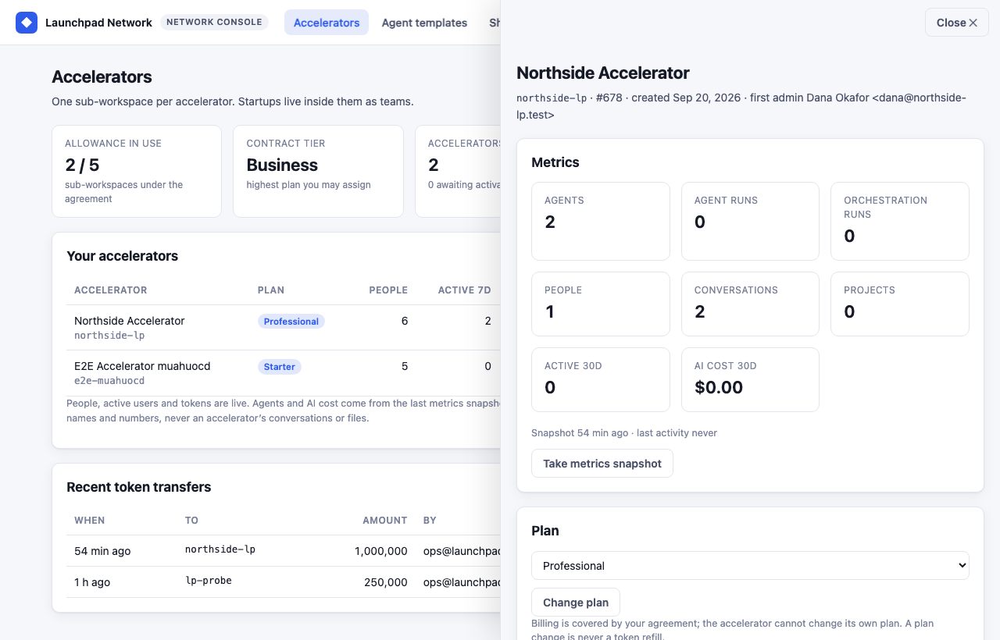
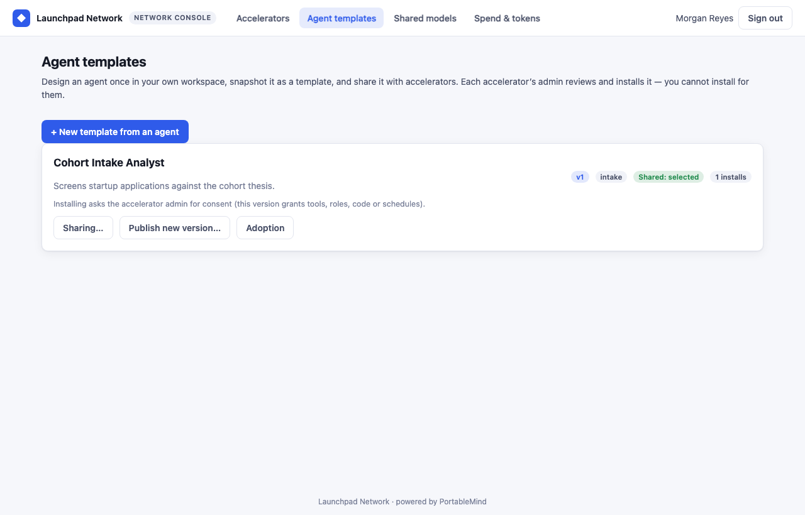
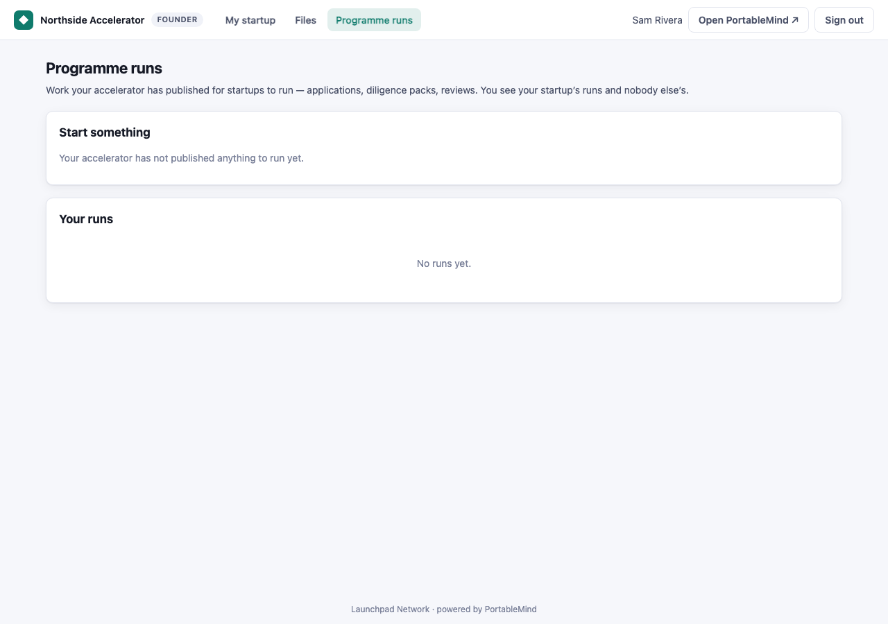
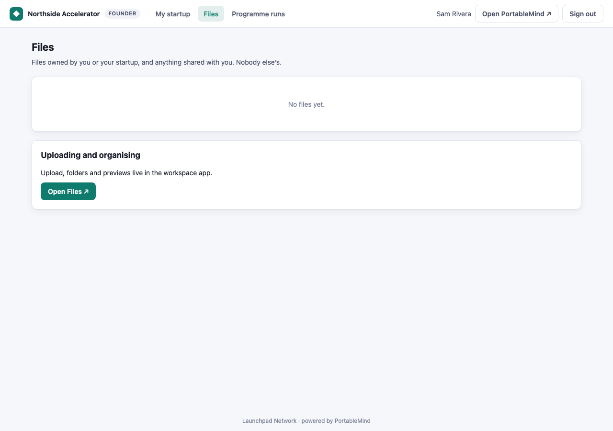

# Launchpad Network — Enterprise + sub-workspaces reference app

A working sample of the PortableMind **Enterprise** and **sub-workspace** features, built the way a new
customer would build it: from the partner integration guide and its AI companion prompt, then tested end
to end against PortableMind staging.

The scenario: **Launchpad Network** runs startup accelerators. The network is one Enterprise workspace.
Each accelerator gets its own **sub-workspace**, and each startup is a **team** inside its accelerator.
The network designs AI agents once and publishes them as templates. It can share its own AI model with
a spend cap, fund accelerators with tokens, brand each accelerator, and measure all of them, without
ever seeing their content.

It sits alongside the other reference apps: `pm-ticket-portal` (white-label support portal) and
`pm-agentic-accelerator` (single-workspace accelerator pipeline). Those two predate sub-workspaces; this
one uses them.

```bash
cp .env.example .env     # fill in PM_API, NETWORK_WORKSPACE, SECRET_STORE_KEY (openssl rand -hex 32)
npm start                # → http://localhost:8080   (Node 20.12+, no npm install needed)
```

---

## Who uses it

| Person | Signs in to | Can |
|---|---|---|
| **Network operator**: admin of the Enterprise workspace | the network workspace | create accelerators (with or without activation email), change plans within the contract tier, take metrics snapshots, brand each accelerator and give it white-label sign-on, **transfer purchased tokens** (confirmed, idempotent), publish and version **agent templates** and choose who gets them, **share its own model** with monthly caps, see network-wide spend, delete an accelerator |
| **Accelerator admin**: admin of one sub-workspace | their accelerator | one-time set-up (founder role, sign-up key, invite code), **review and install** templates with an explicit consent screen, upgrade installs (with a diff when a new version grants more), toggle auto-upgrade, detach, see startups, usage, limits and token balance |
| **Founder**: member of a startup team | their accelerator | register their startup with the invite code (email confirmed first), see their team, **chat in their startup's private channel**, **chat privately with the assistants (agents) their accelerator picked**, start a published programme (orchestration), read each step's output and accept it or ask for changes, see their files, invite colleagues with a signed join link. Founders never leave this app and never see the platform behind it |

Screens:

- **Network console**: Accelerators (KPIs for the agreement, allowance, contract tier; per-accelerator
  table; detail drawer), Agent templates, Shared models, Spend & tokens.
- **Accelerator admin**: Set-up checklist, Agent catalog, Installed agents, Startups, Usage & plan. A
  banner shows coverage ("Billing is covered by Launchpad Network's agreement"), or the offboarding
  grace deadline.
- **Founder**: My startup (team + private team chat), Assistants, Programmes (start, follow, review each step), Files.
- Sign-in pages theme themselves from the workspace's white-label branding (`/public/branding`) before
  anyone signs in. MFA sign-ins are handled. `402 billing_required` switches the whole app to a
  "locked for billing" screen instead of failing on whatever page was open.

### Screenshots (staging, 2026-09-20)

| | |
|---|---|
|  |  |
| A startup's private team chat, inside the app | The accelerator admin's one-time set-up |
|  |  |
| Sign-in themed from the accelerator's white-label branding | Network console: agreement, allowance, accelerators |
|  |  |
| Per-accelerator metrics, plan, tokens, branding & sign-on | Templates: version, sharing, adoption |
|  |  |
| Runs a startup can start from published templates | The files a startup can see |

## Architecture

```
Browser ──► this server (same origin) ──► PortableMind API
              /api/v1/*        forwarded AS the signed-in user; Tenant-Id comes from the server-side session
              /lp/auth/*       sign-in (incl. MFA), sign-out, who-am-I, sign-in branding
              /lp/op/*         network-console lanes: create, snapshot, transfer, sign-on key, delete
              /lp/acc/*        accelerator set-up lanes: founder role, provisioning key, invite code
              /lp/founders/*   founder sign-up (provisioning key), roster, add teammate,
                               assistants (agents) and programme runs
              /lp/sso/go       white-label sign-on, signed only for the identity the platform confirms
              /config.js       non-secret runtime config
```

| File | What it does |
|---|---|
| `server.js` | routing, static allowlist, error handling |
| `lib/config.js` | env config; **refuses to start** without `PM_API`, `NETWORK_WORKSPACE`, `SECRET_STORE_KEY` |
| `lib/pm.js` | the one PortableMind client: timeout on every call, never throws on HTTP status, refuses a top-level `tenant_id` |
| `lib/sessions.js` | server-side sessions (HttpOnly, SameSite=Strict cookie); refresh on a timer; on `401`, **one** shared refresh then one retry; a failed refresh signs out |
| `lib/secrets.js` | per-workspace secrets, AES-256-GCM encrypted at rest (`data/secrets.enc`) |
| `lib/store.js` | non-secret state: accelerator registry, pending activations, metrics snapshots, transfer log |
| `lib/sso.js` | HS256 sign-on assertion (90 s, unique `jti`) and the `/app/*` destination allowlist |
| `lib/lanes/*.js` | the lanes above |
| `public/` | the single-page UI: vanilla JS, no build, all rendering via `textContent` |
| `setup/lp-founder.role.export.json` | the scoped, **external** founder role an accelerator imports: projects, tasks and files owner-or-team scoped, conversations and messages **membership**-scoped, and the platform's own participant shape for orchestration runs. The app-baseline permissions come from the built-in `external_member` |

### Design decisions, and the guide rule behind each

- **Everything is per workspace.** The provisioning key, sign-on key and invite code belong to one
  accelerator and live in the secret store under its identifier. The ticket portal is single-workspace;
  this app is not (guide §7.3).
- **The platform decides who someone is.** After every sign-in the server calls `GET /users/current` and
  requires `tenant_enterprise_identifier` to equal the workspace signed into. The session's workspace,
  never a browser header, becomes `Tenant-Id` (guide §7.2).
- **Only the network's own workspaces.** A sign-in to a workspace that is neither the network nor an
  accelerator in the registry is refused *before* any credential is sent. The registry is rebuilt from
  the network's `GET /tenants` each time the console loads. An accelerator missing from a complete
  listing is marked **departed**: its people can no longer sign in here, but its secrets are kept.
  Destroying them is an explicit operator action ("Forget"). A glitchy listing can therefore never
  destroy a key that cannot be recovered.
- **Secrets never reach the browser.** The API pipe matches, and forwards, one canonical path: slashes
  collapsed, `.json`-style suffixes dropped, encoded separators refused. So `//api_keys` or
  `api_keys.json` cannot slip past it. Platform calls that *return* a secret (`POST …/sso_key`,
  `POST /api_keys`) are blocked on the API pipe and handled by lanes that store the value and answer
  `{ stored: true }`. So are irreversible or bookkeeping-sensitive calls (`POST /tenants`,
  `DELETE /tenants/:id`, `transfer_tokens`) and `POST /users`. `allocate_tokens` (staff only) is never
  called.
- **Founders are created by one call.** `POST /users` with the accelerator's provisioning key (built-in
  `provisioner` role), `security_role_iids: "external_member,lp_founder"` always, and `team_name` for a
  new startup. The body is rebuilt from an allowlist. `external_member` is the platform's built-in
  external baseline — what the PortableMind app needs to load for an outside person, and no business
  data; `lp_founder` is this app's scoped role. Set-up refuses to open sign-ups unless both exist.
- **Nobody registers under someone else's email.** By default the platform emails an activation link,
  and the account cannot sign in until it is clicked (`FOUNDER_EMAIL_VERIFICATION`; switch it off only
  for staging demos).
- **A startup's collaboration is scoped by membership, not by a blanket permission.** The app opens
  one **private channel per startup** and keeps its members in step with the team: members see it,
  the accelerator's staff and the other startups do not. Every conversation read in `lp_founder` is
  membership-scoped, every file/project/run read is owner-or-team scoped. An **unscoped** read on a
  model with a `private` flag is a workspace-wide grant — on staging that let a founder of one
  startup post into another's private channel, which is why this app never writes one (and the
  platform now keeps such a grant away from private records).
- **Founders get the app's sections, not its admin.** Sign-up grants `app_chat`, `app_files` and
  `app_projects` next to the scoped role: those unlock the navigation and carry no data of their own.
  `app_admin` — Administration, User Management, AI Studio — is never granted.
- **Founders never see the platform.** Sign-on into the PortableMind app (`/lp/sso/go`) is for
  accelerator staff only; founders get no button, no "powered by" and no platform wording.
  Everything they do happens in this app:
  - **Assistants.** The accelerator admin ticks which agents founders may use (Installed agents →
    Assistants for founders). Each founder gets a private `ai-agent` conversation per agent, with
    the agent as a member. The server prepends the agent's `@mention` to every message, because
    mention-dispatch is what wakes the agent.
  - **Programmes.** Published, non-private orchestration templates. A run is started with
    `owner_party_id` = the startup team, so teammates share it. Each step's output is fetched
    server-side through `/orchestration_executions/:id/artifacts/:aid/download`, which returns a
    signed storage redirect the browser never sees. Founders accept a step
    (`approve_stage`) or send it back with notes (`reject_stage`). The create body is top-level
    (`orchestration_template_id`, `owner_party_id`, `context.feature_request`), not nested.
- **Colleagues join with a signed link, not a handed-over password.** Before issuing one, the server
  checks the roster (read with the key) for the caller's **session** party id. The link is
  HMAC-signed, names one team and expires after 7 days. A colleague who uses it registers with their
  own email and password, and the server sends `team_id`. `team_name` would create a new, empty team
  (guide §7.3, §11 #4).
- **Irreversible actions have friction.** A token transfer needs the accelerator's identifier typed in,
  carries an idempotency reference generated once per dialog (a retry moves tokens once), and is logged.
  Deleting an accelerator needs the same typed confirmation.
- **Heavy metrics are stored.** `GET /tenants/:id/stats` runs on demand, at most once an hour per
  accelerator, and only counts are kept. `llm_cost_stats` labels (conversation and people names) are
  not stored or shown across accelerators (guide §3.6).
- **Consent is bound to what was shown.** Installs send `accept_code` together with the
  `expected_version_id` that was reviewed. `version_changed` re-opens the review; `conflicts`,
  `name_taken`, `402` and `404` each get their own message. An upgrade that needs consent shows a
  manifest diff first.
- **Fail closed.** No provisioning key or invite code means no sign-ups. A roster that can't be read
  means no join link. An unreadable agreement means no create button. An accelerator admin is
  re-checked with the platform before changing sign-up settings.
- **Temporary passwords are replaced, not carried.** An accelerator's first admin signs in with a
  password the network chose, so the platform flags it (`requires_password_change`) and this app makes
  them set their own before anything else. The platform call returns a new session token, so it runs in
  a server lane and is blocked on the API pipe.
- **Rate limits.** Sign-in (30 per 10 minutes per client), MFA codes (5 per attempt) and sign-up (20 per
  hour per client). Set `TRUST_PROXY=1` behind a reverse proxy so the client address comes from
  `X-Forwarded-For`.

## Setting up (staging first)

1. **Enterprise workspace + agreement.** Ask PortableMind for Enterprise on your workspace and a billing
   agreement with an **allowance** (how many accelerators) and a **contract tier** (highest plan).
   That step is not self-service (guide §2).
2. **Some purchased tokens** if you want to fund accelerators. Only purchased tokens transfer.
3. **An agent to publish.** Build and train it in your workspace (AI Studio). Its name may use only
   letters, digits, `-` and `_`.
4. `cp .env.example .env`, fill it in, `npm start`, and sign in with your workspace identifier.
5. Create an accelerator. Its admin signs in here with the initial password you hand over, and runs
   **Set-up**: import founder role → create sign-up key → generate invite code. They send founders the
   sign-up link. Founders confirm their email, sign in, and invite their colleagues from **My startup**.
6. Optional: in the accelerator's drawer, switch white-label on, add this app's host to the return-URL
   allowlist, and **Create sign-on key**. "Open PortableMind" then signs people straight in.

## Tests

```bash
npm test                     # unit: config, secret store, SSO signing, pipe blocklist, sessions (no network)

# end to end, against STAGING — creates one accelerator and deletes it again
E2E_OPERATOR_EMAIL=… E2E_OPERATOR_PASSWORD=… npm run e2e
```

The end-to-end walkthrough drives the real app in-process as operator, accelerator admin and two
founders. It checks 80+ properties, including the negative ones:

- creating an accelerator and reading its real identifier back;
- sign-on key captured, never returned;
- transfer confirmation, idempotent replay, and the pipe blocking `transfer_tokens`;
- template publish, share, install with consent, `code_not_accepted`, `name_taken`, `version_changed`,
  upgrade to v2;
- founder isolation (each founder sees only their startup; no join link for another startup; tampered
  links refused; the colleague lands in the right team);
- email verification on by default (no sign-in before activation);
- the first admin's temporary password: forced change, done through the lane, blocked on the pipe;
- founders holding the built-in `external_member` baseline and the app-section roles;
- a startup's private channel: same channel on re-open, a teammate reads it, another startup can
  neither fetch it, read it, nor post into it;
- files, runs and published templates listing for a founder;
- proxy bypass attempts (`//…`, `.json`, `%2f`);
- role walls between the three kinds of user;
- a real `/sso/exchange` of the signed assertion, and its refused replay.

Last run on DEV (2026-09-21): 82 passed, 0 failed, against the released platform.

## Known limits (platform, as of 2026-09-21)

- **Records belong to whoever creates them.** `owner_party_id` and `owning_team_id` are stamped to
  the creator and cannot be supplied, so a project one founder creates is not visible to their
  teammate through a team scope alone. Team-wide work lives in the startup's channel, where
  membership already covers everyone; anything else needs an explicit share.
- Sessions live in memory: a restart signs everyone out. Swap `lib/sessions.js` for a shared store
  before running more than one instance.
- No live updates (`/cable`) and no file lane. This app does not need them; the ticket portal shows both.

## Production checklist

- `PM_API=https://www.dsiloed.com`, `PM_APP_URL=https://app.portablemind.ai`, `PUBLIC_URL=https://…`
  (turns on Secure cookies).
- Keep `SECRET_STORE_KEY` in your secret manager and back up `data/`. Better still, put
  `lib/secrets.js`'s interface in front of your cloud secret manager.
- Run behind TLS. Serve only this process; it serves an explicit file allowlist from `public/`.
- Tell your accelerators, in these words: the network sees **names and numbers, never content**.
